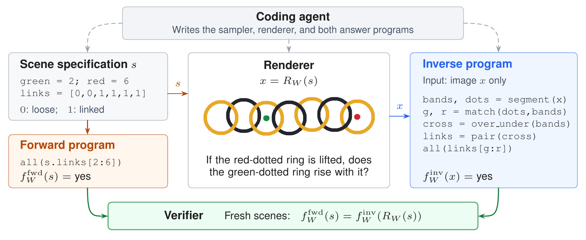

# DualLoop

**Visual Question Generation through Forward–Inverse Agreement**

DualLoop uses coding agents to generate visual questions and programs that verify their
answers. Each agent builds a **question world**: an executable definition of a visual
problem that generates many instances with different objects, positions, or relations.

Each instance is answered in two ways. A **forward program** computes the answer from
the scene specification used to draw the image. An **inverse program** solves the
question from the rendered pixels alone. Protected checks require these answers to agree
on fresh instances. This catches worlds whose answers exist in the generator's internal
state but cannot be recovered by the submitted image-only solver.

This repository runs the paper's three discovery experiments. It includes the
coding-agent interfaces, controller, verifier, starting inputs, and example commands.
The paper also studies downstream fine-tuning; that training pipeline is **not included
in this release**.

## Forward–inverse agreement (Figure 1)

<p align="center">
  
</p>

> **“If the red-dotted ring is lifted, does the green-dotted ring rise with it?”**

In this example from the paper's Figure 1, the answer is **yes**. The forward program
checks the connections recorded in the scene specification. The inverse program segments
the rings and colored markers, infers connections from visible crossings, and checks the
chain between the marked rings. It does not read the scene specification. Both programs
are written by the coding agent; their separation is enforced through their inputs and
interfaces.

Agreement on the tested scenes does not establish that a question is clear to humans,
novel, or difficult for vision–language models. Figure 1 illustrates the method; the
three code examples supplied to agents are listed below. [Figure source and rendering
details](docs/assets/README.md).

## How the discovery loop works

1. The **controller** starts an episode with instructions, reference code, and the
   campaign's current accepted worlds and most recent failure report.
2. A fresh **coding agent** develops one world. It can render examples, run public
   checks, and repair its code before submitting.
3. After submission, the agent environment is replaced with a clean offline
   container. The **verifier** then runs protected checks, including forward–inverse
   agreement on fresh scenes.
4. The controller records the outcome, applies retention criteria, and prepares
   the next episode. Only the saved campaign records carry over; each agent
   starts a new conversation.

A **campaign** repeats these episodes under one configuration and time budget. RQ2 and
RQ3 add guidance to later episodes while keeping the protected checks fixed. See the
paper's **§3, Method**, especially §3.3 for the controller loop.

## Experiments in the paper

The table links each experiment to its setup, results, and run instructions in this
repository. Section numbers refer to the current manuscript.

| Paper experiment | What you run | Paper setup / results | Worked example |
| --- | --- | --- | --- |
| **RQ1 — Construction**: profile-conditioned discovery | Invent worlds under one of nine visual-computation profiles | §4.3 / §5.1 | [Run RQ1](examples/rq1/README.md) |
| **RQ2 — Controllability**: image-support-steered discovery | Add requests about the spatial scale and shape of regions used by the inverse program | §4.4 / §5.2 | [Run RQ2](examples/rq2/README.md) |
| **RQ3 — Evaluator guidance**: model-feedback discovery | Start from ten existing worlds and use evaluator errors to guide later generation | §4.5–4.6 / §5.4 | [Run RQ3](examples/rq3/README.md) |
| **RQ4 — Downstream adaptation** | Fine-tune open-weight models on generated examples | §4.7 / §5.5 | [Release scope](examples/rq4/README.md): training is not packaged |

The release provides one preset each for **Codex, Claude Code, and OpenCode through
OpenRouter**. The paper evaluates five model/reasoning configurations across these three
agent tools; this release includes three example presets. Historical campaigns, result
tables, and the separate 200-scene replay analysis are not included.

## What the agent starts with

All three discovery experiments receive source snapshots of **two-circle contact, angle
acuteness, and counting with distractors**. These teach the interfaces for rendering,
questions, answers computed from scene data, and solving from pixels alone. Runnable
versions are included under `worlds/`; [render them
locally](examples/shared_examples/README.md).

**RQ1 and RQ2** also receive one fixed profile card with five text-only question
directions, construction requirements, and rules against superficial copies of existing
tasks. All five directions appear together in every episode and guide the agent in
designing a new world. The nine profiles are:

| Profile | Intended visual computation |
| --- | --- |
| Tracing | Follow paths, curves, or networks |
| Topology | Recover connectivity, holes, or enclosure |
| Correspondence | Match parts or relations across panels |
| Search | Find the item satisfying visible constraints |
| State tracking | Track identities or states through updates |
| Measurement | Read and compare quantities |
| Prior conflict | Report visible evidence despite familiar expectations |
| Global structure | Combine distributed evidence or negative space |
| Declared transform | Apply an explicitly stated rearrangement |

For example, the Tracing card includes **“Which terminal is farthest from green along
the lines?”** and tells the agent to reconstruct a graph or centerline from pixels.
Profile-specific implementations, images, and answers are not supplied. Read the [exact
cards](foundry/discovery_profiles/paper-semantic/v0.3/) and the [input
guide](docs/INPUTS.md). These correspond to the paper's §4.2 and Table 1.

**RQ3** uses collection A or B, each with ten world implementations and tests, a card
describing the starting worlds and difficulty objective, and fixed evaluator summaries.
It does not use the nine semantic profiles. Starting-feedback JSON includes expected
(gold) answers, model predictions, and whether each prediction is correct; these are not
protected answers for a new submission. Initial image files are absent, but supplied
code can render images and later candidate bundles can contain galleries. See [RQ3
inputs](experiments/rq3/README.md).

## Run your first example

For an assistant operating this repository, [AGENTS.md](AGENTS.md) summarizes the
workflow and the checks to perform before a run.

### 1. Install and check the environment

Use Python 3.12, Git, [uv](https://docs.astral.sh/uv/), and Docker with Compose. Linux,
macOS with Docker Desktop, or Linux in Windows WSL2 can run the container workflow. No
local GPU is required. Start Docker, then run from the repository root:

```bash
uv sync --locked --extra runner --group dev
bash harbor/build_latex_tikz_runtime.sh
uv run --extra runner python -m scripts.doctor
uv run --extra runner python -m scripts.docker_smoke
```

The smoke test uses a fixed example to check container replacement and protected
verification. **It makes no model calls and needs no credentials.** It downloads
dependencies and writes diagnostics under `artifacts/docker-smoke/`. For another smoke
run, add `--out artifacts/docker-smoke-002`. See [setup](docs/SETUP.md) for resource
requirements and troubleshooting. Add `--rq 2` or `--rq 3` and a new `--out` path to
check either of the other discovery experiments without calling a model.

If using a source ZIP, initialize Git before preparing campaigns. The runner records the
source commit and requires a clean working tree:

```bash
git init -b main
git config user.name "DualLoop authors"
git config user.email "anonymous@example.invalid"
git add .
git commit -m "Import DualLoop release"
```

### 2. Prepare a campaign and inspect what the agent will see

```bash
bash examples/rq1/prepare.sh --agent codex --profile tracing --id rq1_tracing_demo
uv run --extra runner python -m scripts.release preview \
  --campaign campaigns/rq1_tracing_demo.toml --out artifacts/rq1-preview
```

These commands create a campaign configuration and the files for its first episode
without contacting a model. The preview prints the task directory: open `instruction.md`
and `environment/starter/` there to read the actual agent inputs.

The default campaign budget is **20 minutes of agent-session time**. For the paper's
six-hour budget, add `--agent-seconds 21600` when preparing; episodes remain capped at
20 minutes. These budgets exclude protected verification and later analysis. Use a new
campaign ID and output directory for every run.

### 3. Authenticate, freeze, and run

Follow the [authentication guide](docs/AUTHENTICATION.md) for your chosen agent tool. It
covers host CLI installation, credential forwarding, a small **paid** authentication
test, and the required provider confirmation variables. RQ3 also needs an OpenRouter
evaluator key, regardless of which coding agent you use.

After inspecting the configuration and completing authentication, freeze the
configuration to mark it ready for execution. Commit it to record the run settings:

```bash
uv run --extra runner python -m scripts.release freeze \
  --campaign campaigns/rq1_tracing_demo.toml
git add campaigns/rq1_tracing_demo.toml
git commit -m "Freeze RQ1 tracing campaign"
bash examples/run_campaign.sh rq1_tracing_demo
```

The final command **starts a paid campaign**. Your account must have access to the
configured model; installing its command-line tool does not establish that access. [All
example walkthroughs](examples/README.md) cover the corresponding RQ2 and RQ3 steps.

## What a run saves

A campaign writes its state, per-episode agent inputs, submitted worlds, protected
verification reports, and evaluator feedback under `artifacts/<campaign-id>/`. RQ2 also
keeps its image-support category record. These local outputs are ignored by Git and are
not included in the source-release ZIP.

To stop after the current episode completes verification:

```bash
touch artifacts/rq1_tracing_demo/STOP_AFTER_CURRENT_EPISODE
```

The runner does **not** resume an interrupted campaign in place. The release includes
world rendering and inverse verification, but has no general command for replaying or
backing up a saved campaign. In particular, the starting-collection smoke check is not
the paper's separate 200-scene replay evaluation.

## Code and further reading

| Location | Contents |
| --- | --- |
| [examples/](examples/README.md) | Step-by-step scripts and walkthroughs for the paper experiments |
| `src/question_foundry/`, `scripts/run_sequential_campaign.py` | Controller state, episode construction, guidance, and execution |
| `harbor/` | Coding-agent adapters, Docker images, public/protected verification integration |
| `foundry/`, `configs/agents/`, `experiments/` | Versioned instructions, profiles, policies, and campaign configurations |
| `worlds/`, `inputs/starting_collections/` | Three runnable reference worlds and two ten-world starting collections |
| [docs/INPUTS.md](docs/INPUTS.md) | Input files and what agents can read |
| [docs/RELEASE_NOTES.md](docs/RELEASE_NOTES.md) | Differences from historical campaigns and known frozen-prompt inconsistencies |
| [docs/VALIDATION.md](docs/VALIDATION.md) | Tests performed and remaining live-provider checks |

Run the local test suite with `uv run --extra runner pytest -q`. Figure 1 is included
for the README. Manuscript sources, historical agent traces, and credentials are
excluded.

Licensed under [CC BY-NC 4.0](LICENSE). Attribution: **DualLoop authors** (anonymous
release). Dependencies retain their own licenses.
